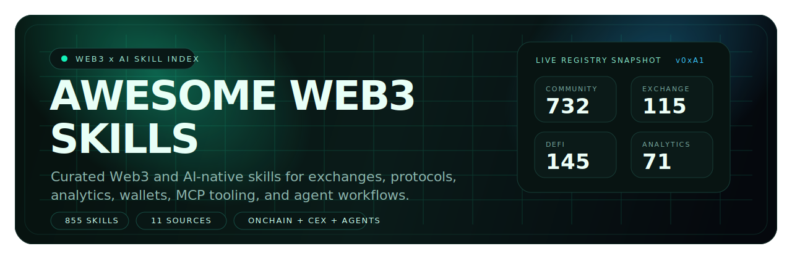

<p align="center">
  
</p>

<p align="center">
  
  
  
</p>

<p align="center">
  
  
  
  
  
</p>

# Awesome Web3 Skills

An opinionated, cyber-terminal flavored index of Web3 and AI-native skills collected in one repository.

This project brings together exchange-native workflows, protocol integrations, DeFi research helpers, analytics tooling, wallet and payment flows, MCP servers, and agent-ready utilities. The goal is simple: make high-signal Web3 skills easier to discover, compare, and reuse.

## Why This Repository Exists

The Web3 skill landscape is fragmented. Useful skills are scattered across exchange repos, protocol examples, community registries, and one-off agent toolkits. This repository consolidates that surface area into a single navigable index with a lightweight risk review artifact.

It is designed for:

- AI agent builders who want ready-made Web3 capabilities
- Researchers who need analytics, onchain, and market tooling in one place
- Developers looking for protocol, exchange, and wallet integration patterns
- Operators who want faster discovery before installing or adapting a skill

## Signal Snapshot

| Layer | Count | What It Covers |
| --- | ---: | --- |
| Total skills | 855 | All indexed `SKILL.md` entries in this repository |
| Source groups | 11 | Exchange, protocol, and community skill families |
| Exchange skills | 115 | Binance, Binance Web3, BingX, Gate, OKX, BitMart, Bybit, Crypto.com, Biget |
| DeFi skills | 145 | Community DeFi skills plus Uniswap-native skills |
| Analytics skills | 71 | Market data, research, dashboards, and onchain intelligence |
| Agents & MCP | 108 | MCP servers, AI-crypto workflows, and developer tooling |
| Wallets & payments | 89 | Wallet operations, payment flows, and transfer tooling |

## Source Map

| Source | Skills |
| --- | ---: |
| Community | 732 |
| Gate | 44 |
| BingX | 22 |
| Binance | 18 |
| OKX | 13 |
| Uniswap | 8 |
| Binance Web3 | 7 |
| Biget | 5 |
| BitMart | 3 |
| Crypto.com | 2 |
| Bybit | 1 |

## Community Category Highlights

The community set is the largest part of the repository and covers the broadest operational surface:

- `community/exchanges` — 178 skills
- `community/defi` — 137 skills
- `community/analytics` — 71 skills
- `community/mcp-servers` — 67 skills
- `community/payments` — 66 skills
- `community/chains` — 46 skills
- `community/trading` — 42 skills
- `community/prediction-markets` — 26 skills
- `community/wallets` — 23 skills
- `community/ai-crypto` — 21 skills

## Repository Layout

```text
.
├── skills/
│   ├── binance/
│   ├── binance-web3/
│   ├── bingx/
│   ├── bybit/
│   ├── community/
│   ├── crypto-com/
│   ├── gate/
│   ├── okx/
│   └── uniswap/
├── skill_risk_table.md
└── README.md
```

## How To Navigate

1. Start with [`skills/`](./skills) and choose a source family or domain.
2. Open each skill folder and inspect its `SKILL.md`.
3. Review any bundled references, scripts, or API notes before reuse.
4. Check [`skill_risk_table.md`](./skill_risk_table.md) for the repository's current risk summary.

## Security Note

This repository is curated, not guaranteed safe by default. Skills may include prompts, scripts, API calls, signing flows, wallet operations, or automation logic that should be reviewed before installation or execution.

Treat every skill as executable capability, not just documentation. Read the source, validate permissions, and prefer least-privilege usage when adapting skills into agent workflows.

## Style Of This Index

This README intentionally frames the repository like a registry rather than a plain folder dump:

- Web3-first discovery
- AI-agent and MCP awareness
- Exchange plus protocol coverage in one place
- High-signal counts instead of exhaustive badge spam
- GitHub-friendly presentation with a custom local banner

## Disclaimer

Brand names, protocol names, and platform names in this repository belong to their respective owners. Inclusion here does not imply affiliation, endorsement, or audit status.
