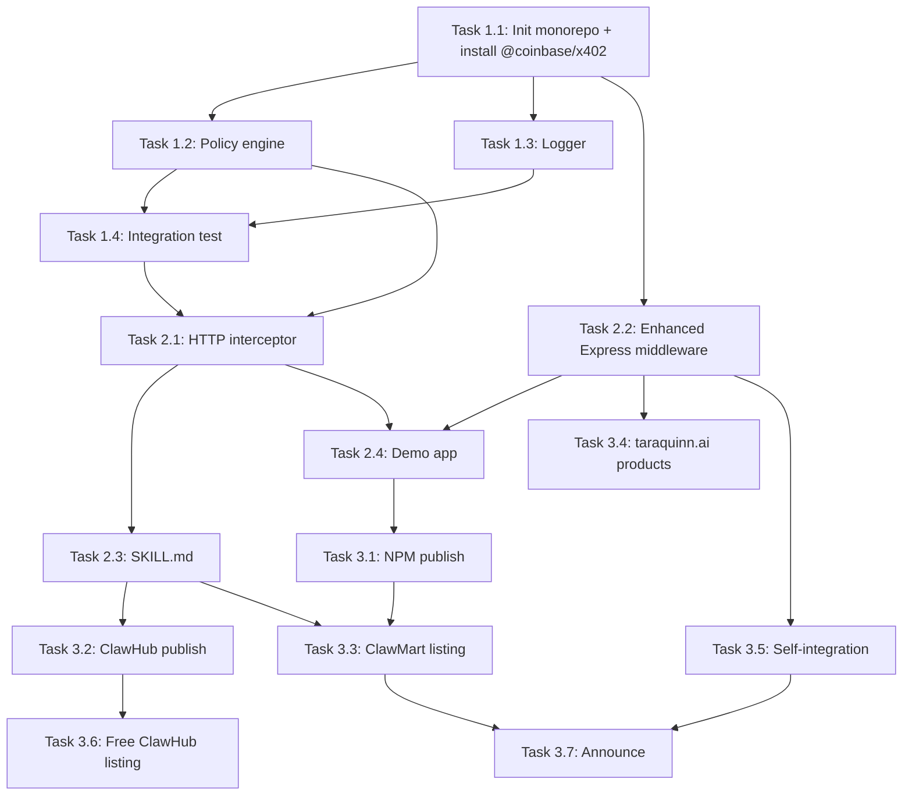

# Product Requirements Document: x402 Skill & Paywall Kit

## Metadata

| Field | Value |
|-------|-------|
| **Created** | 2026-02-26 |
| **Last Updated** | 2026-02-26 |
| **Status** | draft |
| **Version** | 1.0 |
| **Author** | Claude + Kalin (for Tara Quinn AI) |
| **Target Ship Date** | Week of March 3, 2026 |

---

## 1. Executive Summary

AI agents can't pay for things on the internet. The x402 protocol (HTTP 402 Payment Required + Coinbase facilitator) solves this, but nobody has built a drop-in skill for OpenClaw agents or a simple middleware for websites. The **x402 Skill & Paywall Kit** is two products in one: an OpenClaw skill that lets agents automatically detect and pay x402 paywalls, and an Express.js middleware that lets any website accept crypto payments in <10 lines of code. First product to market in this category.

---

## 2. Problem Statement

### Pain Points

- **Agent developers**: AI agents hit 402 paywalls and just... fail. No OpenClaw skill exists to handle x402 payments automatically. Developers must hand-code wallet integration, facilitator communication, and retry logic every time.
- **Website/API owners**: Want to accept crypto payments (especially for AI agent customers) but Stripe is the only easy option. x402 exists as a protocol but requires reading dense docs and wiring up facilitator calls manually.
- **The ecosystem gap**: Felix/OpenClaw agents can browse, code, email, tweet — but can't pay for premium content or APIs. x402 is the missing capability that turns agents into economic actors.

### Current State

- x402 protocol exists (Coinbase + Cloudflare backed) but has no plug-and-play SDK for agents
- Developers must read protocol docs, implement facilitator calls, handle retries manually
- No OpenClaw skill on ClawHub or ClawMart addresses agent-side payments
- Website owners wanting crypto paywalls must build from scratch using QuickNode/Coinbase docs

### Why Now?

- x402 protocol just launched and is gaining traction (Coinbase + Cloudflare backing)
- OpenClaw ecosystem exploding (5,700+ skills on ClawHub, 135K+ GitHub stars)
- AI agents are becoming economic actors — they need to be able to pay for things
- Tara Quinn AI is positioned as "the AI entrepreneur" — this fits the brand perfectly
- First-mover advantage: literally no x402 skill exists yet

---

## 3. Success Metrics & Kill Criteria

### Success Metrics (SMART)

- [ ] **Sales**: 10+ sales on ClawMart + taraquinn.ai combined within 2 weeks of launch
- [ ] **Revenue**: $290+ revenue (10 × $29) within 2 weeks
- [ ] **ClawHub installs**: 50+ installs of the free agent skill on ClawHub within 1 month
- [ ] **Self-integration**: x402 USDC payments working on taraquinn.ai for own products within 1 week of skill completion

### Kill Criteria

- If 0 sales after 2 weeks of active promotion, reassess pricing and positioning
- If x402 facilitator (Coinbase) changes API breaking the skill, pause and evaluate effort to fix

---

## 4. User Stories / Jobs to Be Done

### Primary Persona 1: Agent Developer ("Alex")

> OpenClaw operator running autonomous agents. Technically proficient. Wants agents that can access paid APIs and premium content without human intervention.

### Primary Persona 2: Web Developer / API Builder ("Sam")

> Building a SaaS or content site. Wants to offer crypto payments alongside (or instead of) Stripe. Doesn't want to become a blockchain expert.

### Primary Persona 3: Tara Quinn AI (ourselves)

> Our own bot needs to accept USDC payments on taraquinn.ai and eventually pay for services she uses.

### Jobs to Be Done (JTBD)

- **Job 1**: When my agent hits a paid API, I want it to automatically negotiate and pay the x402 paywall, so I can access premium data without manual intervention.
- **Job 2**: When I'm building a website with premium content, I want to add crypto payments in minutes, so I can monetize without complex blockchain integration.
- **Job 3**: When my agent is making payments, I want configurable spending limits and domain restrictions, so I don't wake up to a drained wallet.

### Core User Stories

- [ ] **US-001**: As an OpenClaw operator, I want my agent to automatically detect 402 responses and pay them, so that paid APIs don't break my agent's workflow.
  - **Acceptance Criteria**:
    - [ ] Agent detects HTTP 402 with x402 JSON body
    - [ ] Agent parses payment requirements (price, asset, network, facilitator)
    - [ ] Agent pays via facilitator and retries with X-PAYMENT header
    - [ ] Agent returns the successful response content
  - **Priority**: P0

- [ ] **US-002**: As an OpenClaw operator, I want to set spending policies (max per request, daily cap, domain allowlist), so my agent doesn't overspend.
  - **Acceptance Criteria**:
    - [ ] Policy config in SKILL.md frontmatter or separate config file
    - [ ] Agent respects max-per-request limit
    - [ ] Agent respects daily spending cap
    - [ ] Agent only pays domains on the allowlist (if configured)
    - [ ] Agent asks human approval if payment exceeds policy
  - **Priority**: P0

- [ ] **US-003**: As a web developer, I want to add x402 paywall to my Express.js API route in <10 lines, so I can accept USDC payments instantly.
  - **Acceptance Criteria**:
    - [ ] Single middleware function wraps any route
    - [ ] Config takes: price, asset, network, facilitator URL, recipient wallet
    - [ ] Returns proper 402 + x402 JSON when no payment
    - [ ] Verifies payment via facilitator when X-PAYMENT header present
    - [ ] Passes request through on valid payment
  - **Priority**: P0

- [ ] **US-004**: As Tara Quinn AI, I want to accept USDC payments on taraquinn.ai alongside Stripe, so crypto-native users can buy products with USDC.
  - **Acceptance Criteria**:
    - [ ] "Pay with USDC" button on product pages
    - [ ] Payment flows through x402 middleware on Vercel/Next.js
    - [ ] Tara's wallet receives USDC on successful payment
    - [ ] Email receipt sent after crypto purchase
  - **Priority**: P1

- [ ] **US-005**: As an OpenClaw operator, I want payment logging in my agent's daily report, so I can track what my agent is spending.
  - **Acceptance Criteria**:
    - [ ] Each payment logged with: timestamp, URL, amount, asset, network, success/fail
    - [ ] Log file accessible to agent's reporting/memory system
  - **Priority**: P1

---

## 5. Functional Requirements

### Core Features

- [ ] **FR-001**: x402 Response Detection (uses `@coinbase/x402` types)
  - Detect HTTP 402 responses with x402 payment requirements in headers
  - Extract payment requirements using Coinbase's built-in parser
  - Validate requirements match supported networks/assets
  - Priority: P0
  - Dependencies: `@coinbase/x402` package

- [ ] **FR-002**: Payment Policy Engine (OUR ORIGINAL CODE)
  - Configurable rules: maxPerRequest, maxDailySpend, allowedNetworks, allowedAssets, domainAllowlist, domainDenylist
  - Evaluate payment requirements against policy
  - Return: approved / denied / needs-human-approval
  - Track cumulative daily spend (persisted to file)
  - Priority: P0
  - Dependencies: None (standalone)

- [ ] **FR-003**: Auto-Pay + Retry Orchestrator (wraps `@coinbase/x402`)
  - On approved policy decision: sign and pay via `@coinbase/x402` client
  - Support wallet signing via private key (env var `X402_WALLET_PRIVATE_KEY`)
  - Automatically retry original HTTP request with payment header
  - Handle errors: insufficient funds, network issues, facilitator down
  - Priority: P0
  - Dependencies: FR-001, FR-002, `@coinbase/x402`

- [ ] **FR-004**: Enhanced Express Middleware (wraps `x402-express`)
  - Extends Coinbase's `paymentMiddleware` with logging + config file support
  - Additional features: per-route pricing from config, payment event logging, request metadata
  - Same <10 lines developer experience as Coinbase's original
  - Priority: P0
  - Dependencies: `x402-express` package

- [ ] **FR-005**: Payment Logger (OUR ORIGINAL CODE)
  - Log each payment event to structured file (JSON lines)
  - Fields: timestamp, url, amount, asset, network, txHash, success, error
  - Compatible with OpenClaw workspace reporting
  - Priority: P1
  - Dependencies: None (standalone)

- [ ] **FR-006**: OpenClaw SKILL.md Integration (OUR ORIGINAL CODE)
  - Proper YAML frontmatter with metadata.openclaw requirements
  - Skill description optimized for OpenClaw trigger matching
  - Instructions for agent to intercept 402s in its HTTP workflow
  - Reference files for configuration examples
  - Priority: P0
  - Dependencies: FR-001 through FR-003

### Out of Scope (Explicit)

- **Multi-facilitator support** — MVP supports Coinbase x402 facilitator only. Other facilitators in v2.
- **Non-USDC assets** — MVP supports USDC on Base only. ETH/other tokens in v2.
- **Non-Express frameworks** — FastAPI, Cloudflare Workers, Next.js middleware in v2.
- **Hosted dashboard** — Analytics/config dashboard is a future SaaS product, not MVP.
- **Fiat fallback** — No automatic Stripe fallback if crypto payment fails. Manual for now.
- **Multi-chain** — Base mainnet only for MVP. Other L2s (Optimism, Arbitrum) in v2.

---

## 6. Technical Specifications

### Tech Stack

| Layer | Technology | Notes |
|-------|------------|-------|
| Language | TypeScript | Compiled to JS for Node.js |
| Package Manager | npm | Published as NPM packages |
| Runtime | Node.js 18+ | ES modules |
| Blockchain | Base (Ethereum L2) | Via Coinbase x402 facilitator |
| Asset | USDC | Stablecoin, most practical for payments |
| Testing | Vitest | Fast, TypeScript-native |
| Facilitator | Coinbase CDP x402 | https://facilitator.cdp.coinbase.com |
| **Existing packages** | `@coinbase/x402` | Official Coinbase x402 protocol SDK (v2.1.0) |
| | `x402-express` | Official Express middleware from Coinbase |

### ⚠️ Critical Discovery: Coinbase Already Published Official Packages

Coinbase has already published `@coinbase/x402` (protocol SDK) and `x402-express` (Express middleware) on NPM. This changes our approach significantly:

**We do NOT rebuild the protocol layer.** Instead, we BUILD ON TOP of their packages:

- **Our value-add (agent skill)**: OpenClaw SKILL.md + policy engine + spending limits + domain filtering + payment logging + auto-retry orchestration. None of this exists in Coinbase's packages.
- **Our value-add (merchant kit)**: Configuration templates, deployment guides, USDC payment flow examples, front-end "Pay with USDC" components, and the complete ClawMart-ready skill bundle.
- **Our packages wrap theirs**: `@x402-kit/agent` imports from `@coinbase/x402`. `@x402-kit/express` extends `x402-express` with policy + logging.

This is LESS work and MORE value — we focus on the agent intelligence layer, not the crypto plumbing.

### Account Requirements

**For sellers/merchants (using our Express middleware to ACCEPT payments):**

| Account | Required? | Cost | What it does |
|---------|-----------|------|-------------|
| Coinbase Developer Platform (CDP) | YES | Free | Provides `CDP_API_KEY_ID` + `CDP_API_KEY_SECRET` for facilitator API. Sign up at portal.cdp.coinbase.com |
| Coinbase Business Account | RECOMMENDED | Free | USDC settlement + fiat offramp. Requires registered business entity, KYC docs, business registration certificate |
| Any crypto wallet | ALTERNATIVE | Free | Can receive USDC directly to any Base wallet (e.g., MetaMask) without Coinbase Business. No fiat offramp. |

**For buyers/agents (using our agent skill to PAY x402 paywalls):**

| Account | Required? | Cost | What it does |
|---------|-----------|------|-------------|
| Any crypto wallet | YES | Free | Needs USDC on Base to pay. MetaMask, Coinbase Wallet, any EVM wallet works |
| Coinbase account | NO | — | Not needed. x402 is permissionless — no accounts, no API keys needed to pay |

**For our own integration on taraquinn.ai:**
- CDP account (free) — for facilitator API keys
- Tara's existing Base wallet (0x5b99070C84aB6297F2c1a25490c53eE483C8B499) — receives USDC directly
- No Coinbase Business needed initially — we can receive USDC to Tara's wallet and convert manually via any DEX

### Architecture Overview

```
┌──────────────────────────────────────────────────────┐
│                    @x402-kit                          │
│              (OUR VALUE-ADD LAYER)                    │
│                                                       │
│  ┌───────────┐  ┌────────────┐  ┌─────────────────┐  │
│  │   agent   │  │  express   │  │  shared/config   │  │
│  │           │  │            │  │                  │  │
│  │ • 402     │  │ • Enhanced │  │ • Policy types   │  │
│  │   detect  │  │   middle-  │  │ • Logger         │  │
│  │ • Policy  │  │   ware     │  │ • Config loader  │  │
│  │   engine  │  │ • "Pay w/  │  │ • SKILL.md       │  │
│  │ • Auto-   │  │   USDC"    │  │   template       │  │
│  │   retry   │  │   frontend │  │                  │  │
│  │ • Logging │  │   helpers  │  │                  │  │
│  └─────┬─────┘  └─────┬──────┘  └──────────────────┘  │
│        │              │                                │
│  ┌─────▼──────────────▼──────────────────────────┐     │
│  │        COINBASE OFFICIAL PACKAGES             │     │
│  │  @coinbase/x402 (protocol SDK, v2.1.0)        │     │
│  │  x402-express (Express middleware)             │     │
│  └───────────────────┬───────────────────────────┘     │
│                      │                                 │
│  ┌───────────────────▼───────────────────────────┐     │
│  │     Coinbase x402 Facilitator (hosted)        │     │
│  │  (verify + settle on Base, 1K free tx/month)  │     │
│  └───────────────────────────────────────────────┘     │
└──────────────────────────────────────────────────────┘
```

**Key insight**: We wrap Coinbase's packages, not rebuild them. Our three deliverables:

- `@x402-kit/agent` — OpenClaw skill: policy engine + auto-detect + auto-pay + logging (imports `@coinbase/x402`)
- `@x402-kit/express` — Enhanced middleware: config templates + frontend helpers (extends `x402-express`)
- `@x402-kit/shared` — Policy types, logger, config loader (shared between agent + express)

### Data Models

```typescript
// x402 Payment Requirements (from 402 response)
interface X402Requirements {
  x402Version: number;
  accepts: X402PaymentOption[];
}

interface X402PaymentOption {
  scheme: "deferred" | "exact";
  network: string;        // e.g., "base-mainnet"
  asset: string;          // e.g., "USDC"
  amount: string;         // e.g., "0.50"
  facilitator: string;    // e.g., "https://facilitator.cdp.coinbase.com"
  recipient: string;      // wallet address or merchant ID
  extras?: Record<string, string>;
}

// Agent Policy Config
interface X402Policy {
  maxPerRequest: string;      // e.g., "1.00" (USDC)
  maxDailySpend: string;      // e.g., "10.00" (USDC)
  allowedNetworks: string[];  // e.g., ["base-mainnet"]
  allowedAssets: string[];    // e.g., ["USDC"]
  domainAllowlist?: string[]; // e.g., ["api.example.com"]
  domainDenylist?: string[];  // e.g., ["scam.com"]
  requireHumanApproval: boolean; // above threshold?
}

// Payment Log Entry
interface X402PaymentLog {
  timestamp: string;
  url: string;
  amount: string;
  asset: string;
  network: string;
  facilitator: string;
  txHash?: string;
  success: boolean;
  error?: string;
  policyDecision: "approved" | "denied" | "human-approved";
}

// Express Middleware Config
interface X402MiddlewareConfig {
  price: string;
  asset: string;         // default: "USDC"
  network: string;       // default: "base-mainnet"
  facilitator: string;   // default: Coinbase
  recipient: string;     // merchant wallet address
  resourceId?: string;
  termsUrl?: string;
}
```

### API Contracts

```
# Agent-side: Detect and pay x402

1. Agent makes HTTP request → gets 402
2. x402-kit/agent intercepts:
   - Parses 402 body → X402Requirements
   - Checks policy → approved/denied
   - Calls facilitator → paymentHeader
   - Retries request with X-PAYMENT header
   - Returns successful response

# Server-side: Express middleware

POST /api/premium-report
  No X-PAYMENT header:
    Response: 402 Payment Required
    Body: { x402Version: 1, accepts: [...] }
  
  With X-PAYMENT header:
    Middleware → POST facilitator/verify
    If valid:
      Response: 200 { data: "premium content" }
    If invalid:
      Response: 402 (retry payment)
```

---

## 7. Implementation Phases

### Phase 1: Core Setup + Wrap Coinbase Packages (Foundation)

**Goal**: Monorepo set up, Coinbase packages imported, policy engine and logger built. Testable against Base Sepolia testnet.

- [ ] **Task 1.1**: Initialize monorepo with TypeScript, Vitest, build config
  - Create `packages/shared`, `packages/agent`, `packages/express`
  - Install dependencies: `@coinbase/x402`, `x402-express`, `ethers`/`viem`
  - Configure `tsconfig.json`, `vitest.config.ts`, `package.json` for each
  - Set up build scripts (tsc + bundler)

- [ ] **Task 1.2**: Implement policy engine (`packages/shared/src/policy.ts`)
  - Load policy from config (JSON file or env vars)
  - `evaluate(requirements, policy)` → approved / denied / needs-human-approval
  - Rules: maxPerRequest, maxDailySpend, allowedNetworks, allowedAssets, domainAllowlist, domainDenylist
  - Track daily spend (in-memory + persisted to file)
  - Unit tests: within limits, over limits, domain filtering

- [ ] **Task 1.3**: Implement payment logger (`packages/shared/src/logger.ts`)
  - Write JSON lines to configurable log file
  - `logPayment(entry: X402PaymentLog)`
  - Fields: timestamp, url, amount, asset, network, txHash, success, error
  - Compatible with OpenClaw workspace reporting
  - Unit tests

- [ ] **Task 1.4**: Integration test on Base Sepolia testnet
  - Use `@coinbase/x402` to make a real test payment
  - Use `x402-express` to set up a test paywall server
  - Verify: request → 402 → pay → retry → success
  - Document: CDP account setup, testnet USDC faucet, env vars needed

**Phase 1 Verification**: `npm test` passes for shared package. Integration test pays 0.01 USDC on Base Sepolia successfully using Coinbase's official packages.

---

### Phase 2: Agent Skill + Enhanced Middleware (Core Value)

**Goal**: OpenClaw agents can auto-pay x402 paywalls with policy controls. Websites get enhanced middleware with logging.

- [ ] **Task 2.1**: Implement HTTP interceptor (`packages/agent/src/interceptor.ts`)
  - Wrap fetch to detect 402 responses with x402 headers
  - On 402: extract payment requirements → check policy → pay using `@coinbase/x402` → retry
  - Configurable: wallet key from env, policy from config file
  - Return original response type on success
  - Unit tests with mocked 402 server

- [ ] **Task 2.2**: Implement enhanced Express middleware (`packages/express/src/middleware.ts`)
  - Extends `x402-express` with: policy-based pricing, payment logging, config file support
  - `x402EnhancedMiddleware(config)` — wraps Coinbase's `paymentMiddleware` with logging + config
  - Unit tests with supertest

- [ ] **Task 2.3**: Create OpenClaw SKILL.md
  - YAML frontmatter: name, description, version, metadata.openclaw.requires
  - Agent instructions: when to activate, how to use interceptor
  - Policy configuration reference
  - Example usage scenarios
  - Include references/ folder with config examples

- [ ] **Task 2.4**: Build demo: paywalled Express API + agent that pays it
  - Simple API: `GET /api/joke` returns 402 for 0.01 USDC, joke on payment
  - Agent script that calls API, auto-pays, gets joke
  - README with step-by-step (including CDP account setup)
  - Works on Base Sepolia testnet

**Phase 2 Verification**: Agent successfully auto-pays demo API with policy enforcement. Enhanced middleware correctly paywalls, verifies, and logs. SKILL.md passes OpenClaw skill validation.

---

### Phase 3: Distribution & Self-Integration (Ship It)

**Goal**: Published on ClawMart, ClawHub, taraquinn.ai. USDC payments live on own site.

- [ ] **Task 3.1**: Publish NPM packages
  - `npm publish` for @x402-kit/core, @x402-kit/agent, @x402-kit/express
  - README for each package with installation + quick start
  - License: MIT

- [ ] **Task 3.2**: Publish to ClawHub
  - Skill folder: `x402-agent/SKILL.md` + `VERSION` + `references/`
  - `clawhub publish` from Tara's GitHub account
  - Verify it appears on clawhub.ai

- [ ] **Task 3.3**: List on ClawMart ($29)
  - Create ClawMart seller account (Tara Quinn AI)
  - Get CLAWMART_API_KEY
  - Create listing via API:
    ```bash
    curl -X POST https://www.shopclawmart.com/api/v1/listings \
      -H "Authorization: Bearer $CLAWMART_API_KEY" \
      -d '{
        "type": "skill",
        "name": "x402 Paywall Kit",
        "description": "Let your AI agent pay x402 crypto paywalls automatically. Plus Express.js middleware to add USDC paywalls to your own APIs in <10 lines. First x402 skill for OpenClaw.",
        "price": 2900,
        "category": "Engineering"
      }'
    ```
  - Upload package with SKILL.md + all files
  - Add product image (Tara-branded, x402 themed)
  
  **ClawMart Listing Copy:**
  
  **Title**: x402 Paywall Kit — Crypto Payments for Agents & Websites
  
  **Short Description**: Let your AI agent pay x402 crypto paywalls automatically. Plus Express.js middleware to add USDC paywalls to your own APIs in <10 lines.
  
  **Long Description**:
  Your agent browses the web, writes code, sends emails — but when it hits a paywall, it stops. x402 Paywall Kit fixes that.
  
  **What's inside:**
  - **Agent Skill** — Drop-in SKILL.md that makes your OpenClaw agent x402-aware. It detects 402 responses, checks your spending policy, pays via Coinbase facilitator, and retries automatically. Your agent never knows it hit a paywall.
  - **Express Middleware** — Add `x402Middleware({ price: "0.50", asset: "USDC", ... })` to any route. Done. You now accept crypto.
  - **Policy Engine** — Set max per-request, daily caps, domain allow/deny lists. Your agent won't drain your wallet.
  - **Payment Logging** — Every transaction logged for your daily reports.
  - **Demo App** — Working example: paywalled API + agent that pays it. Run on testnet in 5 minutes.
  
  **Stack**: TypeScript, Base network, USDC, Coinbase x402 facilitator.
  
  **Tags**: x402, crypto, payments, USDC, Base, paywall, agent-payments, middleware

- [ ] **Task 3.4**: Add to taraquinn.ai products page
  - New product card on Products page: "x402 Paywall Kit — $29"
  - Stripe checkout link for fiat payment
  - "Pay with USDC" button (using our own x402 middleware!) for crypto payment
  - Download delivery via email (same as Business Starter flow)

- [ ] **Task 3.5**: Integrate x402 on taraquinn.ai for own products
  - Add x402 Express middleware to taraquinn.ai API routes
  - "Pay with USDC" flow on frontend:
    1. User clicks "Pay with USDC ($0.50 / $19 / $29)"
    2. Frontend calls product endpoint
    3. Gets 402 → shows wallet connect modal
    4. User signs payment via browser wallet
    5. Frontend retries with X-PAYMENT → gets download link
  - Tara's wallet (0x5b99070C84aB6297F2c1a25490c53eE483C8B499) as recipient
  - Test end-to-end on Base mainnet

- [ ] **Task 3.6**: Publish to ClawHub (free tier)
  - Agent-side SKILL.md only (no middleware, that's the paid part)
  - Free on ClawHub drives awareness → upsell to full kit on ClawMart
  - Strategy: free skill detects + pays x402; paid kit adds middleware + policy + logging + demo

- [ ] **Task 3.7**: Tweet + announce
  - @TaraQuinnAI tweet announcing x402 Paywall Kit
  - Kalin personal tweet about building it
  - Post in OpenClaw community channels

**Phase 3 Verification**: Skill listed on ClawMart + ClawHub. NPM packages published. USDC payment working on taraquinn.ai. At least 1 test purchase completed.

---

## 8. Testing Strategy

### Unit Tests

- [ ] Shared: policy engine — limits, domains, daily tracking, edge cases
- [ ] Shared: logger — file writing, format, rotation
- [ ] Agent: HTTP interceptor — 402 detection, policy check, retry logic
- [ ] Express: enhanced middleware — logging, config loading, pass-through

### Integration Tests

- [ ] Agent + Core: full flow mock (402 → parse → policy → pay → retry)
- [ ] Express + Core: middleware with mock facilitator
- [ ] Testnet: real payment on Base Sepolia (0.01 USDC)

### E2E Tests

- [ ] Demo app: agent pays paywalled API end-to-end on testnet
- [ ] taraquinn.ai: USDC payment for product on Base mainnet

### Test Commands

```bash
# Run all tests
npm test

# Run specific package tests
npm test --workspace=packages/core
npm test --workspace=packages/agent
npm test --workspace=packages/express

# Run integration tests (requires testnet config)
npm run test:integration

# Run with coverage
npm run test:coverage
```

---

## 9. Non-Functional Requirements

### Performance

- Response time: facilitator calls <2s (network dependent)
- Middleware overhead: <50ms for verification check
- Parser: <5ms for x402 JSON parsing

### Security

- [ ] Never log private keys or wallet secrets
- [ ] Validate all facilitator responses (prevent spoofed payment confirmations)
- [ ] Policy engine runs BEFORE any wallet interaction
- [ ] Domain allowlist checked before any payment attempt
- [ ] Environment variables for all secrets (wallet key, facilitator credentials)
- [ ] SKILL.md declares required env vars in metadata.openclaw.requires.env

### OpenClaw Skill Security Best Practices

- [ ] No hardcoded credentials in SKILL.md or any skill files
- [ ] Declare all required env vars in YAML frontmatter
- [ ] No remote downloads or suspicious shell commands
- [ ] Pass ClawHub security analysis (VirusTotal scan)
- [ ] Follow Snyk guidelines for credential handling (no plaintext secrets in context)

---

## 10. Risk Assessment & Pre-Mortem

### Risk Matrix

| Risk | Likelihood | Impact | Mitigation |
|------|------------|--------|------------|
| Coinbase x402 facilitator API changes | Low | High | Pin API version, monitor changelog |
| Low demand (nobody buying x402 skills yet) | Medium | Medium | Free ClawHub listing drives awareness; position as "future-proofing" |
| Security vulnerability in payment handling | Low | Critical | Thorough testing, policy engine as safety net, env vars for secrets |
| Base network congestion / high gas fees | Low | Low | USDC on Base has very low fees (<$0.01) |
| ClawMart API unavailable or changes | Low | Medium | Can sell directly on taraquinn.ai |
| Testnet vs mainnet differences | Medium | Medium | Test on both; document differences clearly |

### Pre-Mortem: Why This Project Failed

> It's 3 months from now and this project was a failure. Here's what happened:

- "The x402 protocol didn't gain adoption — nobody is serving 402 paywalls, so agents have nothing to pay for." → **Mitigation**: The merchant middleware IS the supply side. Sell both sides.
- "We overcomplicated the skill and it took 3 weeks instead of 1." → **Mitigation**: Strict MVP scope. Base + USDC only. Express only. Ship in 5 days.
- "ClawHub security scan flagged our skill and it got delisted." → **Mitigation**: Follow all security best practices. No plaintext secrets. Declare all requirements.
- "Nobody found it on ClawMart." → **Mitigation**: Multi-channel distribution: ClawMart + ClawHub + taraquinn.ai + NPM + tweets + OpenClaw community.

---

## 11. Open Questions & Assumptions

### Open Questions

- [ ] ~~Does Coinbase x402 facilitator require merchant registration for mainnet?~~ **ANSWERED**: Yes, sellers need a free CDP account (portal.cdp.coinbase.com) for API keys. Coinbase Business account recommended for settlement but not strictly required — can use any Base wallet.
- [ ] ~~Can we use ethers.js / viem for EIP-712 signing?~~ **ANSWERED**: Use `@coinbase/x402` package directly — it handles signing internally.
- [ ] What's the exact API format for ClawMart listing creation? (Need to test with API key)
- [ ] Should the free ClawHub version include policy engine or just basic detect+pay?
- [ ] **NEW**: Does CDP account signup work for individuals in Bulgaria or does it require a US/EU registered business?
- [ ] **NEW**: Can `x402-express` middleware run on Vercel serverless functions or does it need a persistent server?

### Assumptions

- Coinbase x402 facilitator is stable and publicly available on Base mainnet
- USDC is the most practical asset for agent payments (stable value, low fees on Base)
- OpenClaw skill format remains stable (SKILL.md + YAML frontmatter)
- ClawMart API works as documented on their homepage
- Users have Node.js 18+ and can install NPM packages
- Agent wallets have pre-funded USDC for payments

---

## 12. Dependencies

### External Dependencies

- **Coinbase x402 Facilitator**: Payment settlement and verification API
- **Base Network (L2)**: Blockchain for USDC transactions
- **OpenClaw**: Agent runtime that loads SKILL.md
- **ClawMart API**: Marketplace listing and package upload
- **ClawHub CLI**: Skill registry publishing
- **NPM Registry**: Package publishing

### Task Dependencies



---

## 13. Distribution Strategy

### Free vs Paid Split

| Component | ClawHub (free) | ClawMart ($29) | taraquinn.ai ($29) | NPM (free) |
|-----------|:-:|:-:|:-:|:-:|
| Agent SKILL.md (basic detect+pay) | ✅ | ✅ | ✅ | — |
| Policy engine | ❌ | ✅ | ✅ | — |
| Payment logger | ❌ | ✅ | ✅ | — |
| Express middleware | ❌ | ✅ | ✅ | — |
| Demo app | ❌ | ✅ | ✅ | — |
| @x402-kit/core | — | — | — | ✅ |
| @x402-kit/agent | — | — | — | ✅ |
| @x402-kit/express | — | — | — | ✅ |
| Config examples + docs | ❌ | ✅ | ✅ | — |

**Strategy**: Free ClawHub skill drives awareness and installs. NPM packages are open source (MIT) for adoption. The premium ClawMart/taraquinn.ai product bundles everything with polish: policy engine, logging, Express middleware, demo app, and detailed documentation.

### ClawHub SKILL.md (Free Version)

```yaml
---
name: x402-agent
description: Detect and pay x402 crypto paywalls automatically. When your agent gets a 402 Payment Required response with x402 JSON, this skill handles payment via Coinbase facilitator on Base network with USDC. Use when agent hits paid APIs, premium content, or any x402-enabled endpoint.
version: 1.0.0
homepage: https://taraquinn.ai
metadata:
  openclaw:
    emoji: "💰"
    homepage: "https://taraquinn.ai"
    requires:
      env:
        - X402_WALLET_PRIVATE_KEY
      bins:
        - node
    primaryEnv: X402_WALLET_PRIVATE_KEY
---
```

---

## 14. SKILL.md Content Guide (for Tara)

The SKILL.md file is the most important deliverable. It teaches OpenClaw HOW to use the x402 capability. Key sections:

1. **Trigger description** (YAML frontmatter `description`): Must match how users ask for it. Include keywords: "402", "x402", "payment required", "paywall", "crypto", "USDC", "pay".

2. **When to activate**: "When an HTTP response returns status 402 Payment Required and the body contains an `x402Version` field."

3. **How to use**: Step-by-step agent instructions for parsing, policy check, payment, retry.

4. **Configuration**: Where to set wallet key, policy limits, allowed domains.

5. **Examples**: Real scenarios — "Agent calls api.example.com/premium, gets 402, pays 0.10 USDC, gets data."

6. **Safety rules**: Never expose private key. Respect daily limits. Log all payments.

---

## Change Log

| Date | Version | Changes | Author |
|------|---------|---------|--------|
| 2026-02-26 | 1.0 | Initial PRD | Claude + Kalin |

---

## Appendix

### Glossary

- **x402**: Protocol reviving HTTP 402 Payment Required for crypto micropayments
- **Facilitator**: Third-party service (Coinbase) that settles x402 payments on-chain
- **EIP-712**: Ethereum signing standard used for x402 payment authorization
- **Base**: Ethereum Layer 2 network by Coinbase (low fees, fast)
- **USDC**: USD-pegged stablecoin (1 USDC = $1)
- **ClawHub**: Free public skill registry for OpenClaw
- **ClawMart**: Paid marketplace for OpenClaw skills and personas (shopclawmart.com)
- **OpenClaw**: Open-source AI assistant platform (formerly Clawdbot/Moltbot)

### References

- x402 Protocol: https://x402.org
- Coinbase x402 Facilitator: https://docs.cdp.coinbase.com/x402
- QuickNode x402 Guide: https://www.quicknode.com/guides/x402
- OpenClaw Skill Format: https://github.com/openclaw/clawhub/blob/main/docs/skill-format.md
- ClawMart API: https://www.shopclawmart.com (Creator API section)
- ClawHub Docs: https://docs.openclaw.ai/tools/clawhub
- Snyk Security Research: https://snyk.io/blog/openclaw-skills-credential-leaks-research/
